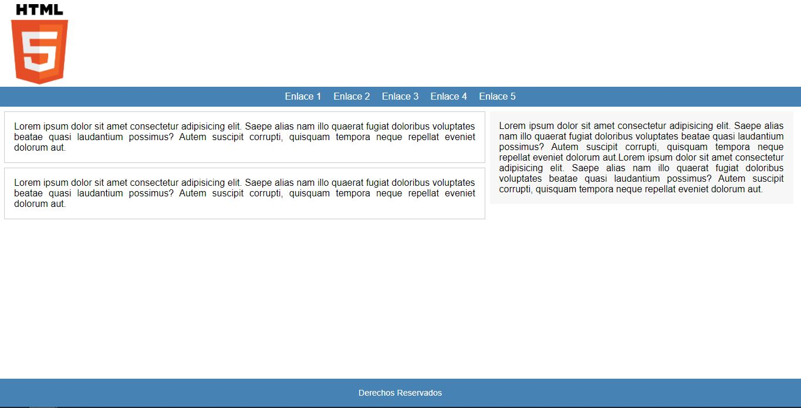
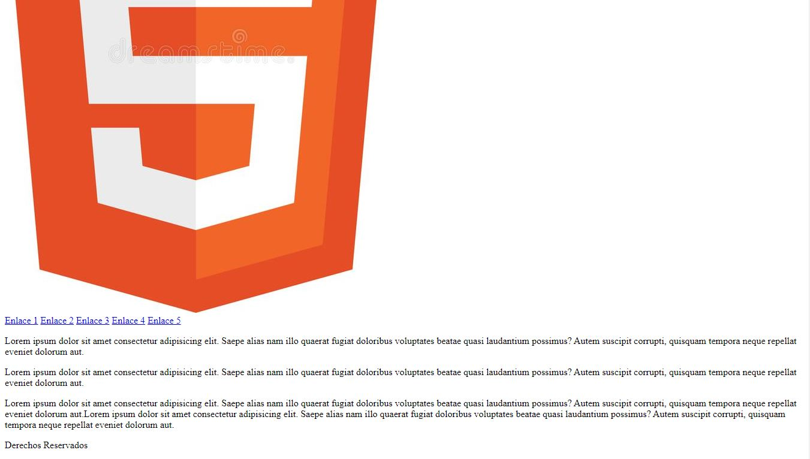

# HTML-CSS  

> ### INSTRUCCIONES DE EJERCITACION

Construiremos en conjunto la siguiente pagina web!!!


> `Forkea` y `Clona` este repositorio en tu `"Local"`

1. Dentro de la carpeta `"Ejercitacion"`, trabajaremos sobre. 

    `mi primera pagina web.html`

2. Definimos el `doctype`, `language`, `head` y todos los meta datos base que necesitamos.
```
<!DOCTYPE html>
    <html lang="es">
    <head>
        <meta charset="UTF-8">
        <meta http-equiv="X-UA-Compatible" content="IE=edge">
        <meta name="viewport" content="width=device-width, initial-scale=1.0">
        <title>Titulo de mi primera pagina web</title>
    </head>
</html>
```
3. Definimos nuestro `body` y la estructura que utilizaremos para `"Maquetar"` nuestra pagina web.
Incluiremos por el momento solo la `base` de nuestro maquetado `header`, `nav`, `section`, `aside`, `footer`. 
```
<!DOCTYPE html>
    <html lang="es">
    <head>
        <meta charset="UTF-8">
        <meta http-equiv="X-UA-Compatible" content="IE=edge">
        <meta name="viewport" content="width=device-width, initial-scale=1.0">
        <title>Titulo de mi primera pagina web</title>
    </head>

    <body>
        <header>
            
        </header>
        <nav>
            
        </nav>
        <section>
            
        </section>
        <aside>
            
        </aside>
        <footer>
        
        </footer>
    </body>
</html>
```
4. Dentro de cada una de las etiquetas `base`, agregaremos ahora informacion que nos permitira hacer mas visible cada una de las partes que estamos `Maquetando`. 
```
<body>
        <header>
            
        </header>
        <nav>
            <a href="#">Enlace 1</a>
            <a href="#">Enlace 2</a>
            <a href="#">Enlace 3</a>
            <a href="#">Enlace 4</a>
            <a href="#">Enlace 5</a>
        </nav>
        <section>
            <article>
            <p>
                Lorem ipsum dolor sit amet consectetur adipisicing elit. Saepe alias nam illo quaerat fugiat doloribus voluptates beatae quasi laudantium possimus? Autem suscipit corrupti, quisquam tempora neque repellat eveniet dolorum aut.
            </p>
            </article>
            <article>
            <p>
                Lorem ipsum dolor sit amet consectetur adipisicing elit. Saepe alias nam illo quaerat fugiat doloribus voluptates beatae quasi laudantium possimus? Autem suscipit corrupti, quisquam tempora neque repellat eveniet dolorum aut.
            </p>
            </article>
        </section>
        <aside>
            <p>
            Lorem ipsum dolor sit amet consectetur adipisicing elit. Saepe alias nam illo quaerat fugiat doloribus voluptates beatae quasi laudantium possimus? Autem suscipit corrupti, quisquam tempora neque repellat eveniet dolorum aut.Lorem ipsum dolor sit amet consectetur adipisicing elit. Saepe alias nam illo quaerat fugiat doloribus voluptates beatae quasi laudantium possimus? Autem suscipit corrupti, quisquam tempora neque repellat eveniet dolorum aut.
            </p>
        </aside>
        <footer>
            <p>Derechos Reservados</p>
        </footer>
    </body>
```
En este punto deberias tener algo como esto:



Recuerda que por el momento, no nos interesa que se vea ordenado ni bonito, de esa parte se encargaran los estilos. 

5. Vamos a dar estilos!
Entre las etiquetas `head` y `body`, utilizaremos la etiqueta `style`, daremos estilos solo a esta hoja utilizando la estrategia `in file` para dar estilos.
```
<!DOCTYPE html>
    <html lang="es">
    <head>
        <meta charset="UTF-8">
        <meta http-equiv="X-UA-Compatible" content="IE=edge">
        <meta name="viewport" content="width=device-width, initial-scale=1.0">
        <title>Titulo de mi primera pagina web</title>
    </head>
    <style>
        
    </style>
    <body>
        ....
    </body>
</html>
```
6. Te vamos a dar toda la base o `propiedades` de estilos, para que solo debas corregir los `valores` o `atributos`, hasta llegar al resultado que estamos buscando.
```
    <style>
        * {
            margin: ;
            padding: ;
        }
        
        body{
            font-family: ;
            font-size: ;
        }
        
        img{
            padding-top:;
            width: ;
        }
        
        nav{
            background-color: ;
            text-align: ;
        }
        
        nav a{
            color: ;
            display: ;
            padding: ;
            text-decoration: ;
        }
        
        nav a:hover{
            color: 
        }
        
        section{
            float: ;
            height: ;
            margin: ;
            width: ;
        }
        
        article{
            border: ;
            margin-top: ;
            padding: ;
        }
        
        p{
            text-align: ;
        }
        
        aside{
            float: ;
            background-color: ;
            height: ;
            width: ;
            margin-top: ;
            padding: ;
        }
        
        footer{
            float: ;
            background-color: ;
            width: ;
            position: ;
            bottom: ;
            padding: ;
        }
        
        footer p{
            text-align: ;
            font-size: ;
            color: ;
        }
        
        nav a, footer p{
            color: ;
        }
    </style>
```
Intenta llegar a este resultado agregando atributos de estilos a las propiedades entregadas !!! :smile:


7. Ahora, has que tus estilos se puedan utilizar en otros documentos `html`. Crea una hoja externa de estilos `misEstilos.css` (en la misma carpeta donde se encuetra tu pagina web `html`) y linkeala a nuestro `html` 
```
<!DOCTYPE html>
    <html lang="es">
    <head>
        <meta charset="UTF-8">
        <meta http-equiv="X-UA-Compatible" content="IE=edge">
        <meta name="viewport" content="width=device-width, initial-scale=1.0">
        <title>Estructura semantica</title>
        <link rel="stylesheet" href="misEstilos.css">
    </head>
    <body>
        ...
    </body>
</html>    

``` 


> Posdata: Recuerda que puedes reunirte con tus compañeros e intentar realizar la ejercitacion juntos !!!

> Como ultima parte de la ejercitacion

Busca el `Home` de alguna pagina web que llame tu atencion e intenta copiarla, maquetando y agregando estilos para imitarla de la mejor forma que puedas 

> Recuerda subir todos los cambios a tu `github` una vez termines la ejercitacion!!!

> ## EXITOS!!!